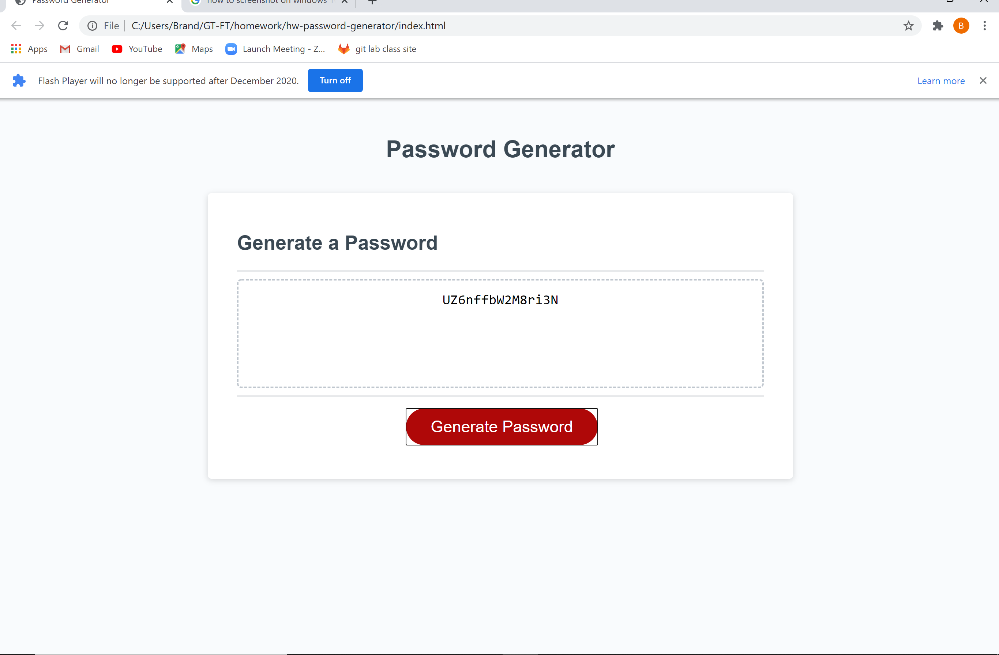

# hw-password-generator

In this homework assignment we where supposed to create a password generator. When the user is prompted to enter desired length, numbers, letters, and special characters. a password is generated with the users input.

## What the end result will look like

## How to get to the new website

[Password Generator webpage](https://brandonwalker88.github.io/hw-password-generator/)

## What the end result is!

The user can now specify how many characters they want to use, and what kind of characters they would like to use to generate a custom password.
